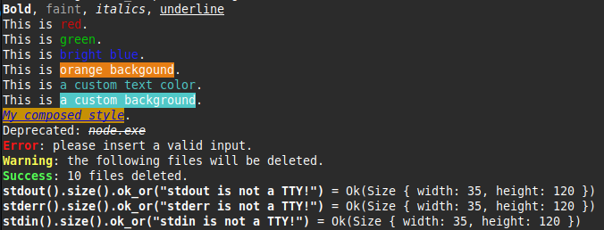

# term-lab.rs
A crate to easily work with terminal styles and get terminal info.

## Usage
Add this to your `Cargo.toml`:
```toml
[dependencies]
term-lab = "1.0.0"
```
Or run this command, *located in your project's root directory*:
```bash
cargo add term-lab
```

## Examples
```rust
use term_lab::styles::{ Stylize, Rgb };

// Use text styles.
println!(
  "{}, {}, {}, {}",
  "Bold".bold(),
  "faint".faint(),
  "italics".italics(),
  "underline".underlined()
);

// Use your terminal's color palette.
println!("This is {}!", "red".red());
println!("This is {}!", "green".green());
println!("This is {}!", "bright blue".bright_blue());
println!("This is {}!", "orange background".orange_bg());

// Use a custom color palette.
println!("This is {}.", "custom".rgb(Rgb(80, 200, 200)));
println!("This is a {}.", "custom background".rgb_bg(Rgb(80, 200, 200)));

// Use a style builder to print less characters and improve performance.
println!(
  "{}.",
  "My composed style"
    .style()
    .blue().yellow_bg()
    .italics()
    .underlined()
    .build()
);

// Some predefined styles.
eprintln!("Deprecated: {}", "node.exe".deprecated());
eprintln!("{}: please insert a valid input.", "Error".error());
eprintln!("{}: the following files will be deleted.", "Warning".warning());
eprintln!("{}: 10 files deleted.", "Success".success());


use std::io::{ stdout, stderr, stdin };
use term_lab::info::TermInfo;

// Get the size of the terminal
debug!(stdout().size().ok_or("stdout is not a TTY!"));
debug!(stderr().size().ok_or("stderr is not a TTY!"));
debug!(stdin().size().ok_or("stdin is not a TTY!"));
```

**Expected output**:<br>


## Performance
Use the `style` method to combine multiple styles and print less characters.

## Crate \[features\]
None at the moment.
